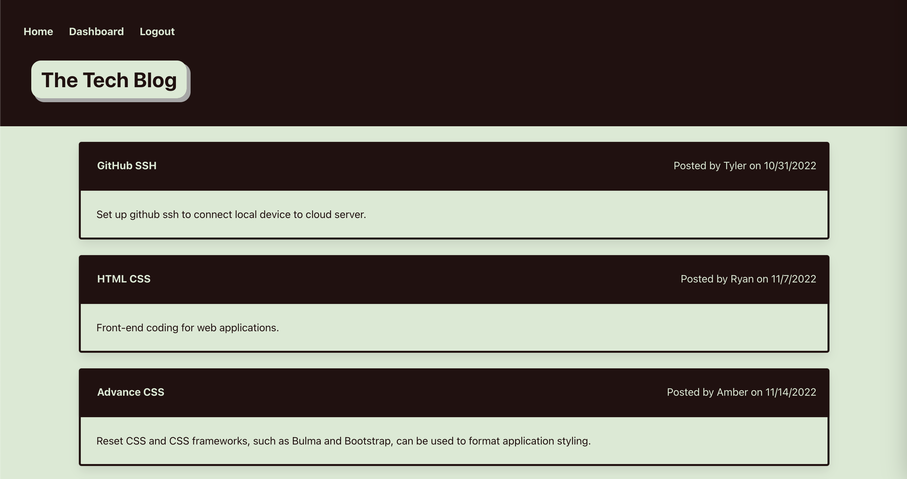

# Module 14 Challenge - Model-View-Controller (MVC): The Tech Blog

>**Application Link:** [The Tech Blog](https://challenge14-the-tech-blog.herokuapp.com/)
>
>**View:** [Description](#description) / [Application Details](#application-details) / [Application Page Preview](#application-page-preview)
>
>**Application Preview:**
>
>
> 
## **DESCRIPTION**
> Topic Assessed: **MVC** - **handlebars, helpers, partials, sessions, cookies, session storage, etc.**
### **My Task**
*The Tech Blog* a CMS-style blog site, where developers can publish their blog posts and comment on other developers’ posts as well.
> 
> Create the application from scratch.
>
> Organize the directory to fit MVC conventions.
>
> Create handlebars for each page.
>
> Create database, models, and seeds. 
>
> Create helper functions and public js files.
> 
> Connect to server and complete the API routes to Perform CRUD Operations.
>
> Sync Sequelize to the Database on Server Start.
> 
## User Story
```
AS A developer who writes about tech
I WANT a CMS-style blog site
SO THAT I can publish articles, blog posts, and my thoughts and opinions
```
## Acceptance Criteria
```
GIVEN a CMS-style blog site
WHEN I visit the site for the first time
THEN I am presented with the homepage, which includes existing blog posts if any have been posted; navigation links for the homepage and the dashboard; and the option to log in
WHEN I click on the homepage option
THEN I am taken to the homepage
WHEN I click on any other links in the navigation
THEN I am prompted to either sign up or sign in
WHEN I choose to sign up
THEN I am prompted to create a username and password
WHEN I click on the sign-up button
THEN my user credentials are saved and I am logged into the site
WHEN I revisit the site at a later time and choose to sign in
THEN I am prompted to enter my username and password
WHEN I am signed in to the site
THEN I see navigation links for the homepage, the dashboard, and the option to log out
WHEN I click on the homepage option in the navigation
THEN I am taken to the homepage and presented with existing blog posts that include the post title and the date created
WHEN I click on an existing blog post
THEN I am presented with the post title, contents, post creator’s username, and date created for that post and have the option to leave a comment
WHEN I enter a comment and click on the submit button while signed in
THEN the comment is saved and the post is updated to display the comment, the comment creator’s username, and the date created
WHEN I click on the dashboard option in the navigation
THEN I am taken to the dashboard and presented with any blog posts I have already created and the option to add a new blog post
WHEN I click on the button to add a new blog post
THEN I am prompted to enter both a title and contents for my blog post
WHEN I click on the button to create a new blog post
THEN the title and contents of my post are saved and I am taken back to an updated dashboard with my new blog post
WHEN I click on one of my existing posts in the dashboard
THEN I am able to delete or update my post and taken back to an updated dashboard
WHEN I click on the logout option in the navigation
THEN I am signed out of the site
WHEN I am idle on the site for more than a set time
THEN I am able to view comments but I am prompted to log in again before I can add, update, or delete comments
```

## **APPLICATION DETAILS**
### server.js Information
* **require**: Defined external and local packages used.
  * `path`, `express`, `express-session`, `express-handlebars`, `routes`, `helpers`
* **port**: Defined the default port as 3001 when no process port is available.
* **handlebars**: Set up Handlebars.js engine with custom helpers.
* **session**: Defined session infor and time limit.
* **sequelize**: Synced sequelize models to the database and launched the server.

### models Information
* **User.js**:
  * `id`: integer, not null, primary key, auto-increment 
  * `username`: string, not null
  * `password`: string, not null, validate len[8]
  * Encrypt password with `bycrypt`
    * Hooks to hash password before create and update
* **Blog.js**: 
  * `id`: integer, not null, primary key, auto-increment 
  * `title`: string, not null
  * `content`: string, not null
  * `date_created`: date, not null, default now
  * `user_id`: integer, references user_id
* **Comment.js**: 
  * `id`: integer, not null, primary key, auto-increment 
  * `comments`: string, not null
  * `date_created`: date, not null, default now
  * `user_id`: integer, references user_id
  * `blog_id`: integer, references blog_id
* **index.js**: 
  * `User hasMany Blog`: foreignKey user_id, cascade on delete
  * `Blog belongsTo User`: foreignKey user_id
  * `User hasMany Comment`: foreignKey user_id, cascade on delete
  * `Comment belongsTo User`: foreignKey user_id
  * `Blog hasMany Comment`: foreignKey blog_id, cascade on delete
  * `Comment belongsTo Blog`: foreignKey blog_id

### homeRoutes Information
* **get('/')**: get blog data and serialize to pass into template
  * include [{ model: User }]
  * renders 'homepage'
* **get('/blog:id')**: get blog data by id and serialize to pass into template
  * include [{ model: User } , {model: Comment}]
  * renders 'commentBlog'
* **get('/dashboard')**: get blog data by session's user_id and serialize to pass into template
  * include [{ model: Blog }]
  * renders 'dashboard'
* **get('/dashboard:id')**: get blog data by id and serialize to pass into template
  * renders 'updateBlog'
* **get('/newBlog')**: renders 'newBlog'
* **get('/login')**: check session and render 'dashboard'
* **get('/signup')**: check session and render 'dashboard'

### api routes Information
* **userRoutes.js**: signup, login, and logout requests paths
  * `post('/')`: POST new account to User
  * `post('/login')`: Verify username and password
    * Create session
  * `post('/logout')`: Destroy session
* **blogRoutes.js**: create, update, and delete blog requests path
  * `post('/')`: POST new blog to Blog
  * `put('/:id')`: Update blog based on id
  * `delete('/:id')`: Delete blog based on id
* **commentRoutes.js**: create new comment request path
  * `post('/')`: POST new comment to Comment
* **index.js**: Define route of api requests.

### Handlebar Information
* **main.handlebar**: Includes page header and logout script.
  * Includes sublayout to render other pages/paths.
* **commentBlog.handlebar**: Specific blog page with comment form
* **dashboard.handlebar**: User's dashboard with their blogs and function to create new blog
* **homepage.handlebar**: Main page with all posted blogs
* **login.handlebar**: Login page with signup page link
* **newBlog.handlebar**: Create new blog page with update and delete buttons.
* **signup.handlebar**: Sign up page with login page link
* **updateBlog.handlebar**: Update and delete form of single blog beloinging to user.

### package.json Information
* **package**: Define the dependencies/packages used in the application.
  * Dependencies: 
    * [bcrypt](https://www.npmjs.com/package/dotenv), version ^5.0.0
    * [connection-session-sequelize](https://www.npmjs.com/package/dotenv), version ^7.0.4
    * [dotenv](https://www.npmjs.com/package/dotenv), version ^8.2.0
    * [express](https://www.npmjs.com/package/express), version ^4.17.1
    * [express-handlebars](https://www.npmjs.com/package/dotenv), version ^5.2.0
    * [express-session](https://www.npmjs.com/package/express), version ^1.17.1
    * [mysql2](https://www.npmjs.com/package/mysql), version ^2.2.5
    * [sequelize](https://www.npmjs.com/package/sequelize), version ^6.3.5

## **APPLICATION PAGE PREVIEW**
### Home Page
>
>
### Login Page
>
>
### Sign Up Page
>
>
### Dashboard Page
>
>
### Update Post Page
>
>
### New Post Page
>
>
### Post and Comment Page
>
>